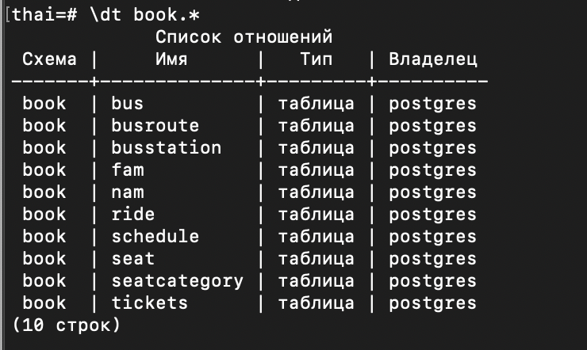
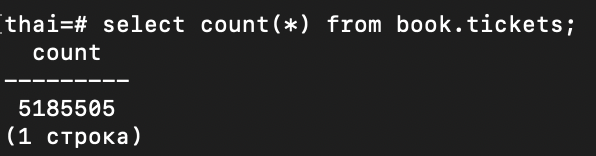

# Модуль 1

## 1. Развернуть ВМ (Linux) с PostgreSQL (у вас есть ВМ в ВБ, любой другой способ, в т.ч. докер)
### Виртуалка развернута в wb-cloud

## 2. Залить Тайские перевозки в минимальном варианте
https://github.com/aeuge/postgres16book/tree/main/database

### Тайские перевозки:

## 3. Посчитать количество поездок - select count(*) from book.tickets;

### Количество поездок:

## 4. Не забываем ВМ остановить/удалить

