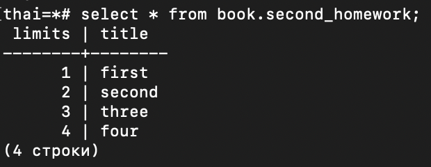

# Модуль 2

### 1. открыть консоль и зайти по ssh на ВМ

### 2. открыть вторую консоль и также зайти по ssh на ту же ВМ (можно в докере 2 сеанса)

### 3. запустить везде psql из под пользователя postgres

### 4. сделать в первой сессии новую таблицу и наполнить ее данными

### 5. посмотреть текущий уровень изоляции:

### 6. начать новую транзакцию в обеих сессиях с дефолтным (не меняя) уровнем изоляции

### 7. в первой сессии добавить новую запись

### 8. сделать запрос на выбор всех записей во второй сессии

### 9. видите ли вы новую запись и если да то почему? После задания можете сверить правильный ответ с эталонным (будет доступен после 3 лекции)

#### Новую запись мы не видим так каку нас стоит уровень изоляции read committed. Пока мы не закомитим первую транзакцию  она нам будет не видна.

### 10. завершить транзакцию в первом окне

### 11. сделать запрос на выбор всех записей второй сессии

### 12. видите ли вы новую запись и если да то почему?

#### Запись видна так как первая транзация была закомичена.

### 13. завершите транзакцию во второй сессии

### 14. начать новые транзакции, но уже на уровне repeatable read в ОБЕИХ сессиях

### 15. в первой сессии добавить новую запись

### 16. сделать запрос на выбор всех записей во второй сессии

### 17. видите ли вы новую запись и если да то почему?

#### Новых записей не видно. Это происходит потому, что уровень изоляции REPEATABLE READ гарантирует, что каждая транзакция видит только те данные, которые были зафиксированы до ее начала.

### 18. завершить транзакцию в первом окне

### 19. сделать запрос во выбор всех записей второй сессии

### 20. видите ли вы новую запись и если да то почему?

#### Новые данные не видны, так как уровень изоляции REPEATABLE READ. Транзакция во второй сессии продолжает видеть только те данные, которые были зафиксированы до ее начала. Новые изменения, зафиксированные после начала транзакции, не будут видны.