### 1. Создать таблицу с текстовым полем и заполнить случайными или сгенерированными данным в размере 1 млн строк

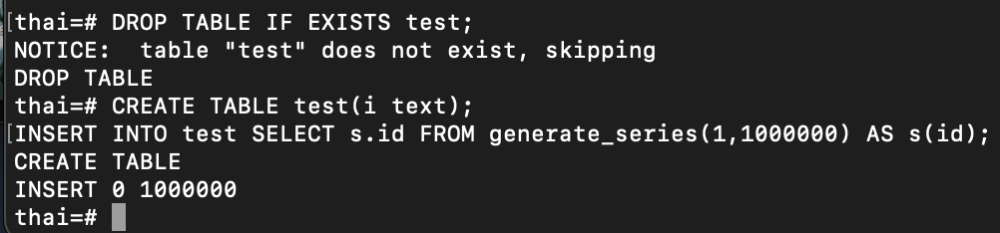

### 2. Посмотреть размер файла с таблицей

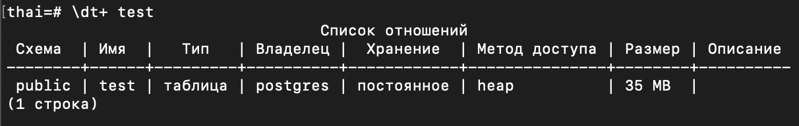

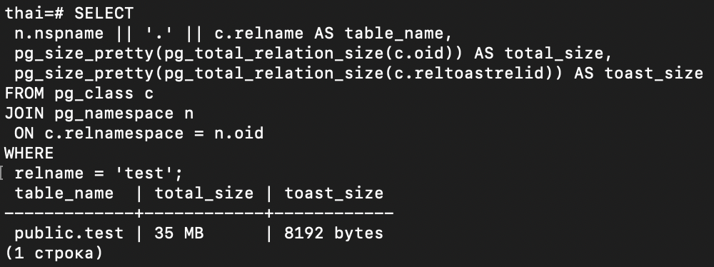

### 3. 5 раз обновить все строчки и добавить к каждой строчке любой символ

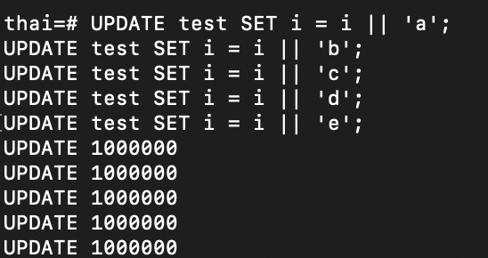

### 4. Посмотреть количество мертвых строчек в таблице и когда последний раз приходил автовакуум

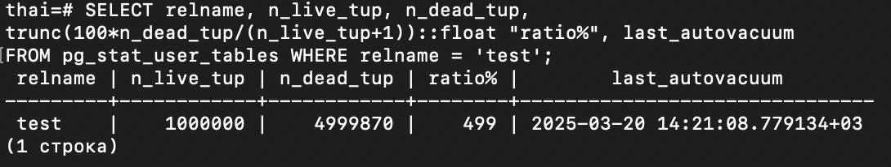

### 5. Подождать некоторое время, проверяя, пришел ли автовакуум

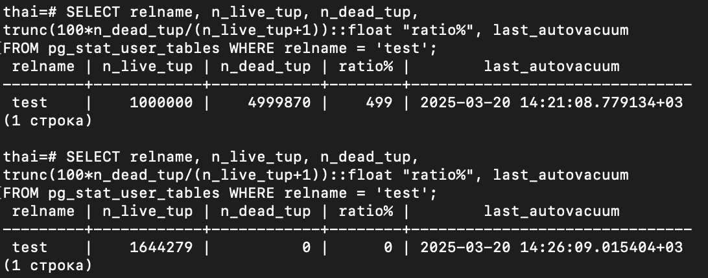

### 6. 5 раз обновить все строчки и добавить к каждой строчке любой символ

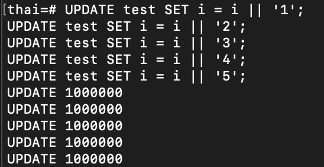

### 7. Посмотреть размер файла с таблицей

### 8. Отключить Автовакуум на конкретной таблице

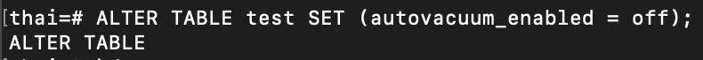

### 9. 10 раз обновить все строчки и добавить к каждой строчке любой символ

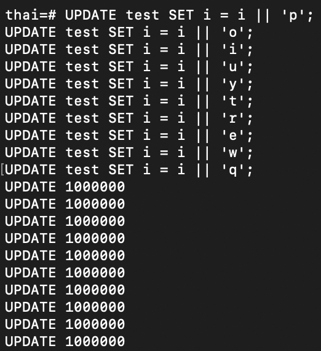

### 10. Посмотреть размер файла с таблицей

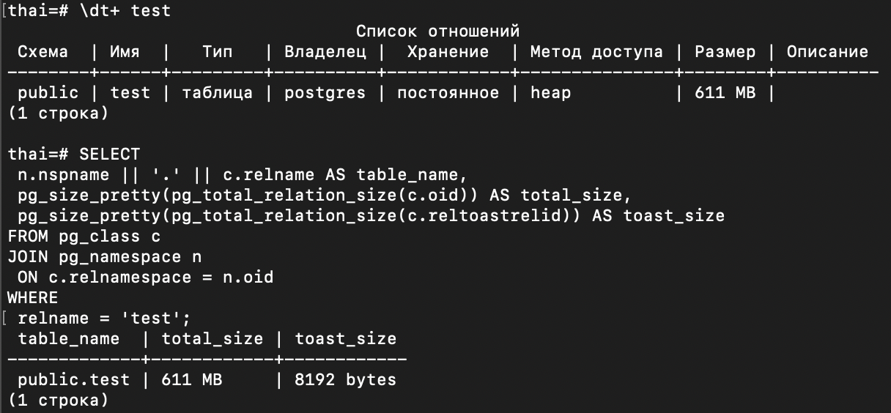

### 11. Объясните полученный результат

#### На данной таблице отключен автовакуум. Некому собирать мертвые строки(

### 12. Не забудьте включить автовакуум

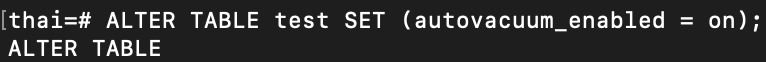

### После VACUUM FULL test

